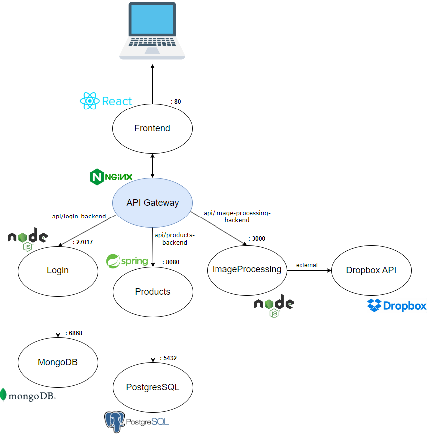
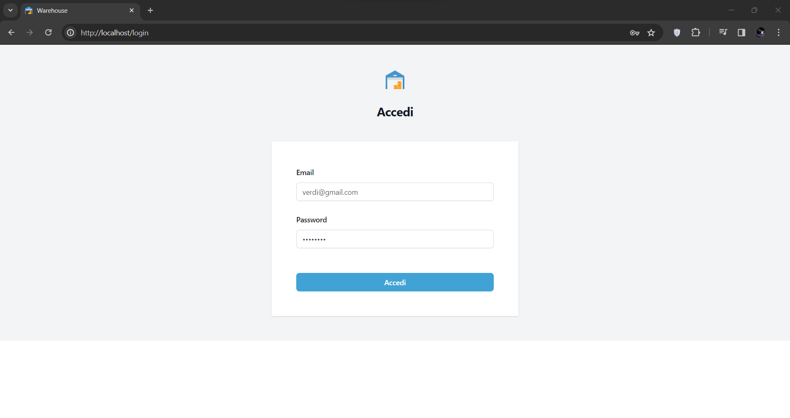
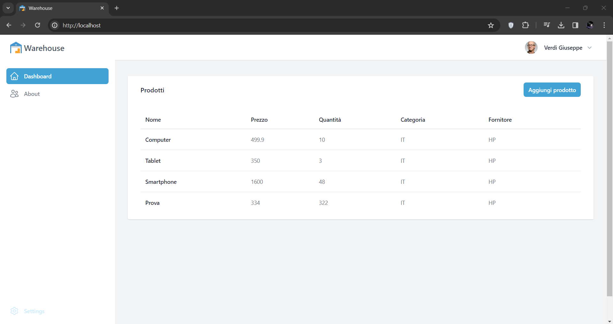
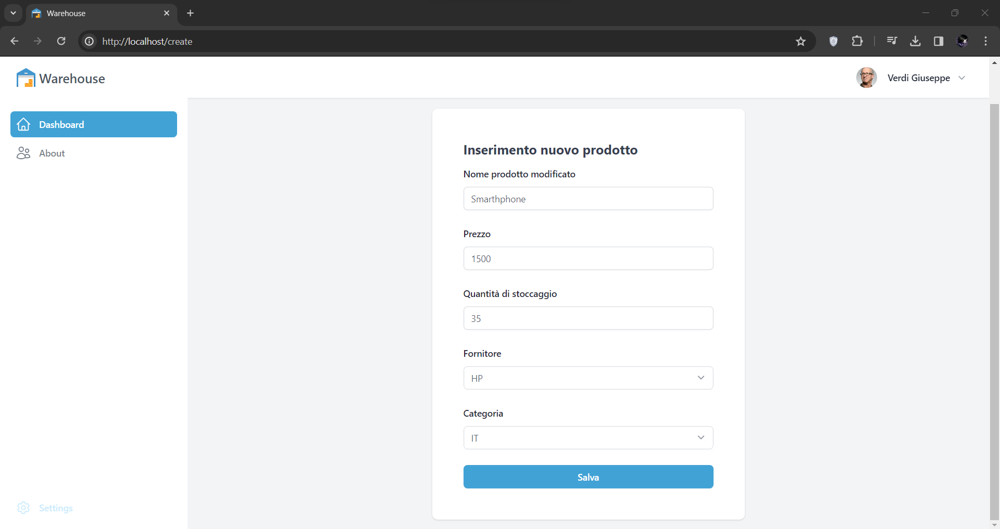
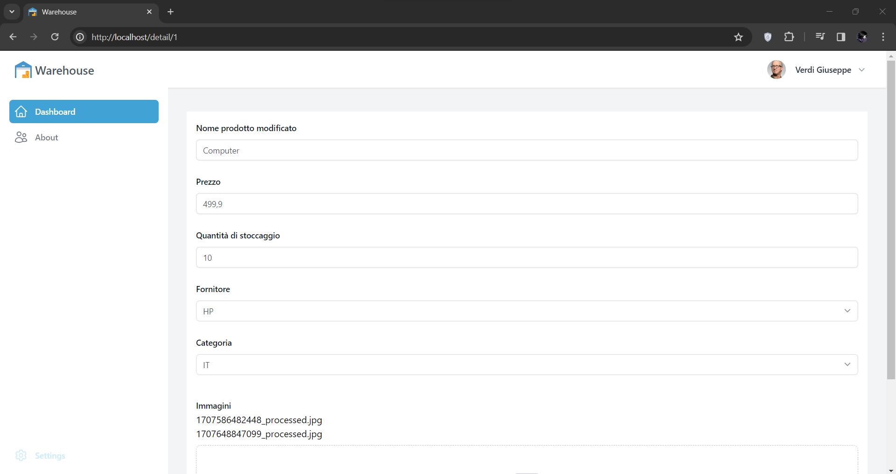
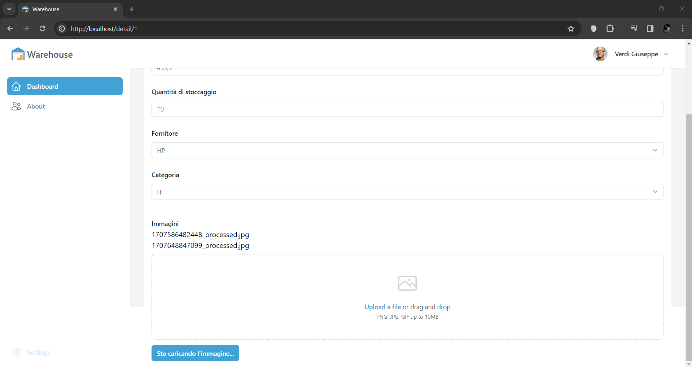

# Cloud Computing Exam Project

## Description

This web application allows users to handle their products with their categories and suppliers. Also, every product can be associated with some images. Users, to make actions on the application, have to log in the platform.

This project has been developed to fulfill the requests of the exam project of the Cloud Computing course, attended in the A.A. 2023-2024, offered by Università di Milano-Bicocca in the Computer Science Master's degree.

Link to the GitLab repository: [https://gitlab.com/s.marotta10/cloud-kubernetes]

## Architecture

The application is based on a microservice architecture, where every microservice is containerized and orchestrated by a Kubernetes cluster.

- frontend-microservice: creates the UI and makes the calls to the backend services to obtain and save data.
- image-processing-microservice: interfaces the external Dropbox API to save and retrieve the images loaded by the users.
- login-microservice: sets up the backend services to allow the users to log in the platform. It is backed up by a MongoDB instance, in which are saved all the users data.
- products-microservice: sets up the backend services to handle the products and their categories and suppliers. Also, links every product to the images saving every image's name in a dedicated table. This microservice is backed up by a PostgreSQL instance.

In the following image, a summary view of the architecture is presented, providing a visual understanding of the project's structure.

<div style="text-align:center">
    
</div>

As requested, there is a GitLab pipeline that Dockerize every microservice, push the created images into the GitLab container registry and set up the local Kubernetes Cluster by applying the yaml manifest files, one for every microservice. Remember that an image is created and deployed only if there are changes in the source code of that specific microservice.

## Installation

To run this project locally, follow these steps:

1. Launch a Minikube instance on your own local machine
2. Fork both the repositories 'cloud-kubernetes' and 'k8s-connection' on your own GitLab workspace
3. Modify the /.gitlab/agents/k8s-connection/config.yaml file with the path of the own 'cloud-kubernetes' repo forked.
4. Register the agent with GitLab: go to Operate > Kubernetes clusters section of GitLab, click on 'Connect a cluster' button and choose the 'k8s-connection' repo forked. GitLab will display the agent access token and the command to install it using Helm. Before launching the command, it is necessary to download [Helm] on your own local machine. Once launched the command, GitLab will show 'Connected' in the 'Connection status' column.
5. [Optional] In every .yaml manifest file there is a reference to the GitLab container registry used during the development and testing phase of the project. To use your own registry, it is necessary to substitute it with the link of yours.
6. Launch the pipeline. Once finished, the containers will be started on your local Kubernetes cluster. To use the platform, it is useful to port forward the port of the frontend service to a port of the host local machine using this command.

```console
kubectl port-forward service/frontend-service 80:80
```

In this example, the service is port-forwarded to port 80 of the host machine, it can be substituted with any port, but make sure that there are no processes on the desired port.

## Usage

Follow these steps:

1. Login into the platform: since there is no registration, to login into the platform it can be used the email 'verdi@gmail.com' and the password 'verdi123'.

<p align="center">
    
</p>

2. Into the Dashboard there are all the stocked products with a summary view that contains the attributes "Nome", "Prezzo", "Quantità", "Categoria", "Fornitore"

<p align="center">
    
</p>

3. Once logged into the platform, it is possible to create own products into the specific interface, provided by pressing button "Aggiungi prodotto" into Dashboard.

4. Here is the provided interface for a new product creation

<p align="center">
    
</p>

5. By clicking on the product's name in the dashboard, it is possible to visualize product's details. Then, in the same page, it is possible to associate the product with some images by uploading them into the specific box.

<p align="center">
    
</p>

(Scrolling at the bottom of the page there is the image uploading box)

<p align="center">
    
</p>


## Contributors

The MLR group work is formed by:
- [Salvatore Marotta] 844795
- [Luca Loddo] 844529
- [Matteo Rondena] 847381

## License

This project is licensed under the MIT license - see the [LICENSE.md](LICENSE.md) file for details.

[Helm]: https://helm.sh/docs/intro/install/
[Salvatore Marotta]: https://gitlab.com/s.marotta10
[Luca Loddo]: https://gitlab.com/lucaloddo
[Matteo Rondena]: https://gitlab.com/MatteoRondena
[https://gitlab.com/s.marotta10/cloud-kubernetes]: https://gitlab.com/s.marotta10/cloud-kubernetes